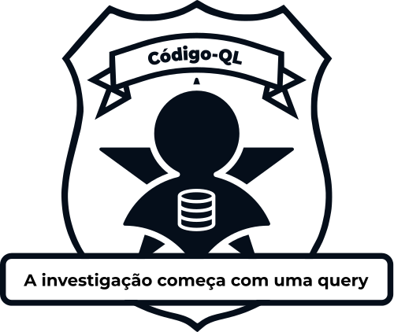

# Bem-vindo à Documentação do Código-QL

  

Olá, professor(a) e colaborador(a)!

Esta documentação é o guia central para entender a estrutura da plataforma **Código-QL** e como você pode contribuir com novos capítulos e níveis de exercícios.

O Código-QL foi desenvolvido como um Trabalho de Conclusão de Curso (TCC) em Engenharia de Software na Universidade de Brasília (UnB) por Natan Tavares Santana, com o objetivo de criar uma abordagem prática e lúdica para o ensino de consultas SQL.

## Primeiros Passos

- **[Como Contribuir](contributing.md):** Se você deseja adicionar novos exercícios, comece por aqui.
- **[Licença](license.md):** Entenda os termos de uso e distribuição do projeto.